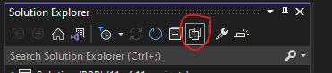
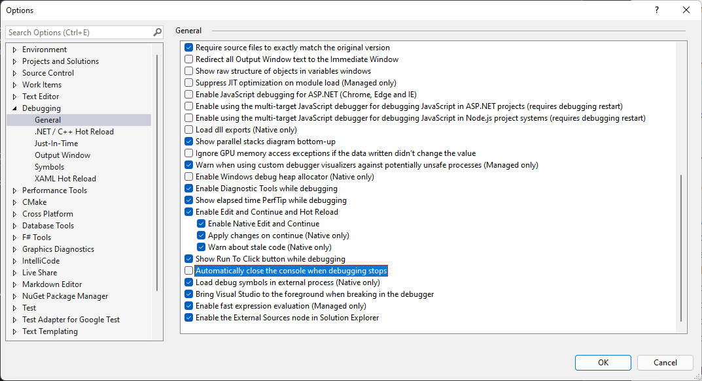

## Stroustrup, Bjarne. Programming: Principles and Practice Using C++.
### Where to buy this book
[Link to PPP on Amazon.](https://www.amazon.com/Programming-Principles-Practice-Using-2nd/dp/0321992784/ref=sr_1_1?s=books&ie=UTF8&qid=1444058171&sr=1-1&keywords=Programming%3A+Principles+and+Practice+Using+C%2B%2B)

### Why
I created this repository to share my solutions for the try its, review questions, drills, and exercises while working my way through
Stroustrup, Bjarne. Programming: Principles and Practice Using C++.

### Useful tools
- [Microsoft Visual Studio Community](https://www.visualstudio.com/en-us/products/visual-studio-community-vs.aspx) is what I will be using for the exercises from this book.
- [vcpkg](https://vcpkg.io/en/index.html) is a free C/C++ package manager for acquiring and managing libraries.

### Notes
I will be using Microsoft Visual Studio Community to go through this book with compiler set to C++ latest. 
I created a solution folder named PPP and added each section as projects.
In the solution properties I selected Current selection under Common Properties/Startup Project. Play with the selections and pick what you prefer. 

If the sections contain multiple files with a main function just right click on the file and select Exclude from Project solution explorer tab.
Can always go back and add files back by selecting Include in Project. In the Solution Explorer tab you can select view all files to see all the included and excluded files.
if have files with 2 main functions will get this error `fatal error LNK1169: one or more multiply defined symbols found` 
 

I will be using added statements to pause the program to see the program output ex: `std::cin.get();	//wait for a character to be entered`
or can use another method baked into visual studio by checking if not already enabled can select Tools/Options/Debugging/General 
 

### Deviations / Status
If you're reading along you will notice I intentionally left out the header file mentioned in the book.  Instead I created a section header file for each of the sections 
because in the book's presented header file the functions have been implemented into most modern compilers, plus I wanted some experience dealing with custom header files.
If you want, you can get the header file from book's website [www.stroustrup.com/Programming](https://www.stroustrup.com/programming_support.html). 
<b>section 0<b> 
book organization stuff 
<b>section 1</b>
general software history and things to think about 
<b>section 2</b> complete
were coding exercises start.  
<b>section 3</b> complete 
<b>section 4</b> complete 
<b>section 5</b> complete 
<b>section 6</b> complete 
<b>section 7</b> complete
Starting in this section, I will be using a general a header file in the project include folder for this section and the remaining sections. 
Right or wrong, I removed the syncing of the cpp streams to the c streams by defining [std::cin.sync_with_stdio(false)](https://en.cppreference.com/w/cpp/io/ios_base/sync_with_stdio).
Normally all C++ streams have this set to true. This will provide better reliability into the cin.rdbuf()->in_avail() function.
Seems to be compiler dependent on how count is reported if set to true. Again right or wrong I don't know but I needed to see if anything is in the cin.rdbuf,  see ppp.h for additional details.
Also set up namespace (ppp) for functions unique to this books exercises. 
<b>section 8</b> 
<b>section 9</b>
Exercises 17 and 18 are incomplete. 
<b>section 10</b> 
<b>section 11</b>
Exercises are not completed. 
<b>section 12</b>
For help using the FLTK library I'm using [vcpkg](https://github.com/microsoft/vcpkg) C/C++ library manager.
See section_12.vcxproj to see how I set FLTK includes and libs files.
I have mine one folder up from my project root folder ($(SolutionDir)..\vcpkg\installed\x64-windows-static\include) this may vary depending on OS and other options, refer to [vcpkg documentation](https://vcpkg.readthedocs.io/en/latest/)  
Before including classes needed for this section you can compile and run the fltk_test_window.cpp file to check that you linked the libraries correctly.

I'm working my way through the classes used for this section. The files from the books website don't seem to work correctly.
I'm currently debugging these files to get them to work, stay tuned. 

<b>section 13</b> 
<b>section 14</b> 
<b>section 15</b> 
<b>section 16</b> 
<b>section 17</b> 
<b>section 18</b> 
<b>section 19</b> 
<b>section 20</b> 
<b>section 21</b> 
<b>section 22</b> 
<b>section 23</b> 
<b>section 24</b> 
<b>section 25</b> 
<b>section 26</b> 
<b>section 27</b> 

### Some web sites I found helpful
- [Markdown Cheat sheet](https://github.com/adam-p/markdown-here/wiki/Markdown-Here-Cheatsheet)
- [CPP reference](http://en.cppreference.com/w/Main_Page) is a good C and C++ reference
- [LearnCpp.com](http://www.learncpp.com/) is a good C++ reference with good examples
- [Microsoft CPP](https://docs.microsoft.com/en-us/cpp/cpp/?view=msvc-170)
- [fltk documentation](https://www.fltk.org/documentation.php) is good reference but when have to use this library use vcpkg

### Disclaimer
I'm new at this so any suggestions or comments are appreciated.
